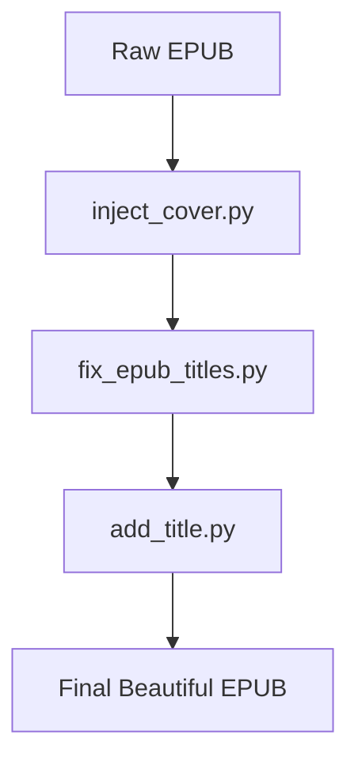

# EPUB Tools Collection

 

A set of Python scripts to **enhance and clean up EPUB files** by:
- Injecting custom cover images.
- Fixing missing chapter titles.
- Adding a styled title page.

Perfect for personal ebook libraries, especially ripped or incomplete web novels!

---

## Table of Contents
- [Features](#features)
- [Scripts](#scripts)
- [Installation](#installation)
- [Usage](#usage)
- [Workflow Example](#workflow-example)
- [Troubleshooting](#troubleshooting)
- [Notes](#notes)
- [License](#license)

---

## Features
- **Inject Cover**: Replace or add a high-quality cover image.
- **Fix Titles**: Auto-generate missing `<h1>` titles from the Table of Contents (TOC).
- **Add Title Page**: Create a beautiful, centered title page as the book’s opening.
- **Proper EPUB Packaging**: Maintains EPUB standards (e.g., `mimetype` first uncompressed).
- **Lightweight** and **Fast**: Uses `lxml` and `BeautifulSoup` for quick XML/HTML parsing.

---

## Scripts

### 1. `inject_cover.py`
- **Function**: Replaces or adds a cover image.
- **Command**:
  ```bash
  python inject_cover.py input.epub output.epub cover.jpg
  ```

### 2. `fix_epub_titles.py`
- **Function**: Adds `<h1>` chapter titles extracted from the EPUB navigation files (EPUB 2/3).
- **Command**:
  ```bash
  python fix_epub_titles.py input.epub output.epub
  ```

### 3. `add_title.py`
- **Function**: Creates a new title page and inserts it as the first page.
- **Command**:
  ```bash
  python add_title.py input.epub output.epub
  ```

---

## Installation

### Requirements
- Python 3.6+
- Install dependencies:
  ```bash
  pip install lxml beautifulsoup4
  ```

**(Optional)**  
If using on Android (Termux):
```bash
pkg install python
pip install lxml beautifulsoup4
```

---

## Usage

Each script is standalone, but **you can chain them for best results**:

1. **Inject Cover** → 2. **Fix Chapter Titles** → 3. **Add Title Page**

Example full workflow:
```bash
python inject_cover.py raw.epub temp1.epub my_cover.jpg
python fix_epub_titles.py temp1.epub temp2.epub
python add_title.py temp2.epub final_output.epub
```

At the end, `final_output.epub` will have:
- A custom cover.
- Proper chapter titles.
- A stylish title page.

---

## Workflow Example



---

## Troubleshooting

### My EPUB file looks blank after using the scripts!
- **Possible Cause**: The `mimetype` file was compressed when rebuilding the EPUB.
- **Solution**: These scripts already handle that, but if manually editing, ensure `mimetype` is the first file and **uncompressed** in the ZIP archive.

### The cover image does not appear!
- **Possible Cause**: 
  - The reader app may cache the old cover.
  - The cover file may not be correctly referenced inside the OPF file.
- **Solution**: 
  - Clear the app cache or reload the EPUB.
  - Ensure you are using `inject_cover.py` correctly and that the cover file is a `.jpg`.

### Chapter titles are still missing!
- **Possible Cause**: 
  - The EPUB has a broken or missing Table of Contents (TOC) file.
- **Solution**:
  - `fix_epub_titles.py` depends on a valid NAV (EPUB3) or NCX (EPUB2) file. If your EPUB doesn't have one, this script won't find titles.

### EPUB reader says "corrupted file"!
- **Possible Cause**:
  - Incorrect EPUB structure (common if manually editing archives).
- **Solution**:
  - Always use the provided scripts to rebuild EPUBs properly.
  - Make sure the structure has `mimetype` at root, and all internal links are valid.

### Unicode or character encoding issues?
- **Possible Cause**: 
  - Some EPUBs may have non-UTF-8 encoded HTML files.
- **Solution**: 
  - Manually open the XHTML files and re-save them as UTF-8.
  - You can also preprocess with BeautifulSoup to enforce UTF-8 encoding.

---

## Notes
- Always **make backups** before modifying EPUBs.
- These scripts assume **standard EPUB structure**; heavily corrupted files may fail.
- Title text for the title page (`LEVEL UP ZOMBIE`) is hardcoded but can be easily edited inside `add_title.py`.
- If you encounter encoding issues, ensure your EPUB uses UTF-8.

---

## License
MIT License — feel free to modify, improve, and share!
