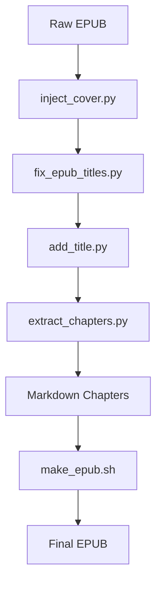

# EPUB Tools Collection

  

A suite of scripts and utilities to **enhance, extract, and package EPUB files** for personal ebook libraries, especially web novel rips or incomplete books.

---

## Table of Contents

* [Features](#features)
* [Scripts](#scripts)

  * [1. inject\_cover.py](#1-inject_coverpy)
  * [2. fix\_epub\_titles.py](#2-fix_epub_titlespy)
  * [3. add\_title.py](#3-add_titlepy)
  * [4. extract\_chapters.py](#4-extract_chapterspy)
  * [5. make\_epub.sh](#5-make_epubsh)
* [Installation](#installation)
* [Usage](#usage)
* [Workflow Examples](#workflow-examples)
* [Troubleshooting](#troubleshooting)
* [Notes](#notes)
* [License](#license)

---

## Features

* **Inject Cover**: Replace or add a high-quality cover image.
* **Fix Titles**: Auto-generate missing `<h1>` titles from the EPUB navigation files (EPUB 2/3).
* **Add Title Page**: Create a custom title page as the book’s opening.
* **Extract Chapters**: Dump chapter titles from an EPUB's TOC to a text file.
* **Build EPUB**: Stitch Markdown-converted chapters into a single EPUB via Bash.
* **Proper EPUB Packaging**: Maintains EPUB standards (e.g., `mimetype` first uncompressed).
* **Lightweight** and **Fast**: Uses `lxml`, `BeautifulSoup`, and `pandoc` for quick processing.

---

## Scripts

### 1. `inject_cover.py`

* **Function**: Adds or overwrites the cover image in an EPUB.
* **Command**:

  ```bash
  python inject_cover.py input.epub output.epub cover.jpg
  ```

### 2. `fix_epub_titles.py`

* **Function**: Inserts missing `<h1>` titles into each chapter HTML/XHTML, using the EPUB TOC (NCX or NAV).
* **Command**:

  ```bash
  python fix_epub_titles.py input.epub output.epub
  ```

### 3. `add_title.py`

* **Function**: Generates and inserts a styled title page at the start of an EPUB.
* **Command**:

  ```bash
  python add_title.py input.epub output.epub
  ```

### 4. `extract_chapters.py`

* **Function**: Reads an EPUB’s TOC and writes all chapter titles to `chapter.txt`.
* **Command**:

  ```bash
  python extract_chapters.py input.epub
  ```

### 5. `make_epub.sh`

* **Function**: Converts a series of DOCX chapter files into Markdown, cleans headings, and assembles them into a single EPUB with metadata and TOC via `pandoc`.
* **Usage**:

  1. Name your chapters `ch01.docx` through `ch21.docx` (or adjust the `seq` range).
  2. Update the script’s `TITLE`, `AUTHOR`, `PUBLISHER`, and `OUT` variables.
  3. Run:

     ```bash
     chmod +x make_epub.sh
     ./make_epub.sh
     ```
  4. Result: `The Weakest Link Book One.epub` (as defined in `OUT`).

---

## Installation

### Requirements

* Python 3.6+
* Bash (for `make_epub.sh`)
* Install Python dependencies:

  ```bash
  pip install lxml beautifulsoup4 ebooklib
  ```
* **Pandoc** (for `make_epub.sh`):

  ```bash
  sudo apt-get install pandoc   # Debian/Ubuntu
  ```
* **Optional (Android/Termux)**:

  ```bash
  pkg install python pandoc
  pip install lxml beautifulsoup4 ebooklib
  ```

---

## Usage

You can run each script standalone, or chain them for a full workflow:

1. **Inject Cover**
2. **Fix Chapter Titles**
3. **Add Title Page**
4. **Extract Chapter Names**
5. **(Optional) Generate EPUB from DOCX**

Example chain:

```bash
python inject_cover.py raw.epub temp1.epub my_cover.jpg
python fix_epub_titles.py temp1.epub temp2.epub
python add_title.py temp2.epub temp3.epub
python extract_chapters.py temp3.epub
./make_epub.sh
```

---

## Workflow Examples



---

## Troubleshooting

### EPUB appears blank

* Ensure `mimetype` is uncompressed and first in archive.
* Use the provided rebuild logic in scripts.

### Cover image not updating

* Clear reader cache.
* Confirm `cover.jpg` path and `properties="cover-image"` in OPF.

### Chapter titles missing after fix

* Verify EPUB has a valid NCX (EPUB2) or NAV (EPUB3) file.

---

## Notes

* Always **backup** your EPUB before modifications.
* Scripts assume **standard EPUB structure**; heavily corrupted files may fail.
* You can edit the title page template in `add_title.py` to customize styling.

---

## License

MIT License — freely modify and share.
