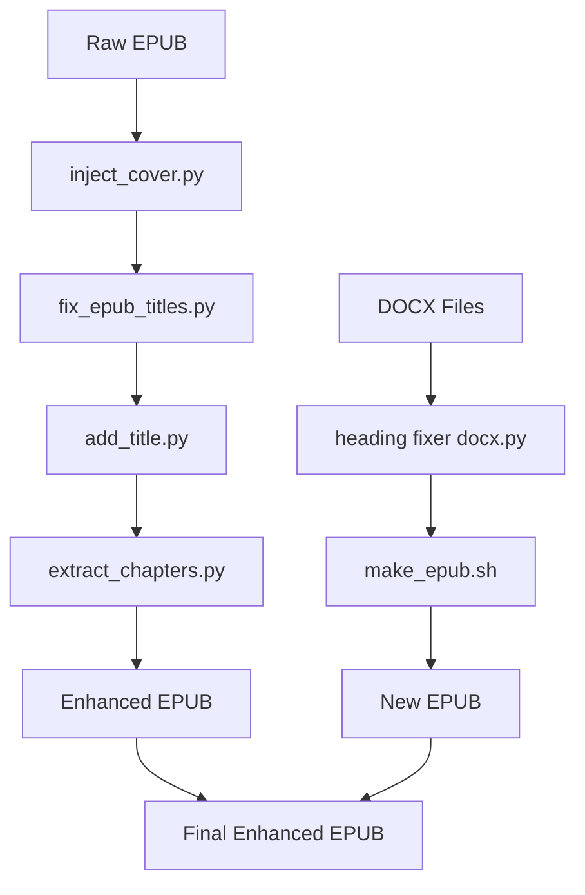

# 📚 EPUB Tools Collection

A comprehensive suite of scripts and utilities to enhance, extract, and package EPUB files for personal ebook libraries, especially web novel rips or incomplete books.

[](https://opensource.org/licenses/MIT)
[](https://www.python.org/downloads/)

---

## Table of Contents

- [Features](#features)
- [Prerequisites](#prerequisites)
- [Installation](#installation)
- [Scripts](#scripts)
  - [inject_cover.py](#1-inject_coverpy)
  - [fix_epub_titles.py](#2-fix_epub_titlespy)
  - [add_title.py](#3-add_titlepy)
  - [extract_chapters.py](#4-extract_chapterspy)
  - [heading fixer docx.py](#5-heading-fixer-docxpy)
  - [make_epub.sh](#6-make_epubsh)
- [Usage](#usage)
- [Workflow Examples](#workflow-examples)
- [Configuration](#configuration)
- [Troubleshooting](#troubleshooting)
- [Contributing](#contributing)
- [License](#license)

---

## Features

- **🖼️ Inject Cover**: Replace or add a high-quality cover image with proper EPUB metadata
- **📝 Fix Titles**: Auto-generate missing `<h1>` titles from the EPUB navigation files (EPUB 2/3)
- **📄 Add Title Page**: Create a custom styled title page as the book's opening
- **📋 Extract Chapters**: Dump chapter titles from an EPUB's TOC to a text file
- **🔧 DOCX Heading Fixer**: Fix misformatted or missing headings inside DOCX files
- **📖 Build EPUB**: Stitch Markdown-converted chapters into a single EPUB via Bash
- **✅ Proper EPUB Packaging**: Maintains EPUB standards (e.g., mimetype first uncompressed)
- **⚡ Lightweight and Fast**: Uses lxml, BeautifulSoup, and pandoc for quick processing

---

## Prerequisites

### System Requirements
- **Python**: 3.6 or higher
- **Bash**: For shell scripts (Linux/macOS/WSL)
- **Operating System**: Linux, macOS, Windows (with WSL), or Android (with Termux)

### External Dependencies
- **pandoc**: Required for `make_epub.sh` script
- **zip/unzip**: Standard archive utilities (usually pre-installed)

---

## Installation

### 1. Clone the Repository
```bash
git clone https://github.com/yourusername/epub-tools-collection.git
cd epub-tools-collection
```

### 2. Install Python Dependencies
```bash
pip install -r requirements.txt
```

**Or install manually:**
```bash
pip install lxml beautifulsoup4 ebooklib
```

### 3. Install Pandoc

**Ubuntu/Debian:**
```bash
sudo apt-get update
sudo apt-get install pandoc
```

**macOS (with Homebrew):**
```bash
brew install pandoc
```

**Windows:**
Download from [pandoc.org](https://pandoc.org/installing.html)

**Android/Termux:**
```bash
pkg install python pandoc
pip install lxml beautifulsoup4 ebooklib
```

### 4. Make Scripts Executable
```bash
chmod +x make_epub.sh
```

### 5. Verify Installation
```bash
python --version
pandoc --version
```

---

## Scripts

### 1. inject_cover.py

**Function**: Adds or overwrites the cover image in an EPUB file while maintaining proper EPUB structure and metadata.

**Command:**
```bash
python inject_cover.py input.epub output.epub cover.jpg
```

**Features:**
- Supports JPG, PNG, and GIF formats
- Automatically updates OPF manifest and metadata
- Preserves existing EPUB structure
- Handles both EPUB 2 and EPUB 3 formats

**Example:**
```bash
python inject_cover.py "Harry Potter.epub" "Harry Potter with Cover.epub" cover.jpg
```

---

### 2. fix_epub_titles.py

**Function**: Inserts missing `<h1>` titles into each chapter HTML/XHTML file, using the EPUB TOC (NCX or NAV).

**Command:**
```bash
python fix_epub_titles.py input.epub output.epub
```

**Features:**
- Automatically detects EPUB 2 (NCX) or EPUB 3 (NAV) format
- Preserves existing formatting and styles
- Handles nested chapter structures
- Skips chapters that already have titles

**Example:**
```bash
python fix_epub_titles.py "raw_novel.epub" "novel_with_titles.epub"
```

---

### 3. add_title.py

**Function**: Generates and inserts a styled title page at the start of an EPUB.

**Command:**
```bash
python add_title.py input.epub output.epub
```

**Features:**
- Creates professional-looking title page
- Extracts title and author from EPUB metadata
- Customizable CSS styling
- Inserts at the beginning of reading order

**Example:**
```bash
python add_title.py "novel.epub" "novel_with_title_page.epub"
```

---

### 4. extract_chapters.py

**Function**: Reads an EPUB's TOC and writes all chapter titles to `chapters.txt`.

**Command:**
```bash
python extract_chapters.py input.epub
```

**Output**: Creates `chapters.txt` in the current directory with all chapter titles.

**Features:**
- Extracts from both NCX and NAV files
- Preserves chapter hierarchy
- Handles special characters and encoding

**Example:**
```bash
python extract_chapters.py "my_novel.epub"
# Creates chapters.txt with all chapter titles
```

---

### 5. heading fixer docx.py

**Function**: Automatically fixes misformatted DOCX chapter headings. Useful for batch-fixing heading levels before EPUB creation.

**Command:**
```bash
python "heading fixer docx.py" input_folder/
```

**Features:**
- Processes all DOCX files in the specified folder
- Fixes heading levels and styles
- Ensures consistent formatting
- Creates backup of original files

**Notes:**
- Processes all DOCX files in the provided folder
- Ensures consistent heading styles for proper EPUB conversion
- Backup files are created with `.bak` extension

**Example:**
```bash
python "heading fixer docx.py" ./chapters/
```

---

### 6. make_epub.sh

**Function**: Converts a series of DOCX chapter files into Markdown, cleans headings, and assembles them into a single EPUB with metadata and TOC via pandoc.

**Prerequisites:**
1. Name your chapters `ch01.docx` through `ch21.docx` (or adjust the seq range in script)
2. Update the script's variables:
   - `TITLE`: Book title
   - `AUTHOR`: Author name
   - `PUBLISHER`: Publisher name
   - `OUT`: Output filename

**Usage:**
```bash
# 1. Make executable
chmod +x make_epub.sh

# 2. Edit variables in script
vim make_epub.sh

# 3. Run
./make_epub.sh
```

**Features:**
- Converts DOCX to Markdown automatically
- Generates proper EPUB metadata
- Creates table of contents
- Handles multiple chapters seamlessly

**Example structure:**
```
project_folder/
├── ch01.docx
├── ch02.docx
├── ...
├── ch21.docx
└── make_epub.sh
```

---

## Usage

### Quick Start
```bash
# Basic workflow for enhancing an existing EPUB
python inject_cover.py raw.epub temp1.epub my_cover.jpg
python fix_epub_titles.py temp1.epub temp2.epub
python add_title.py temp2.epub final.epub
```

### Full Workflow Chain
```bash
# Complete enhancement pipeline
python inject_cover.py raw.epub temp1.epub my_cover.jpg
python fix_epub_titles.py temp1.epub temp2.epub
python add_title.py temp2.epub temp3.epub
python extract_chapters.py temp3.epub
python "heading fixer docx.py" chapters_folder/
./make_epub.sh
```

### Individual Script Usage

**Extract chapter names for reference:**
```bash
python extract_chapters.py "my_book.epub"
cat chapters.txt
```

**Fix DOCX files before conversion:**
```bash
python "heading fixer docx.py" ./raw_chapters/
```

**Create EPUB from DOCX files:**
```bash
# Edit make_epub.sh variables first
./make_epub.sh
```

---

## Workflow Examples



### Workflow 1: Enhancing Existing EPUB
```bash
# For web novel rips or incomplete EPUBs
python inject_cover.py raw_novel.epub step1.epub cover.jpg
python fix_epub_titles.py step1.epub step2.epub
python add_title.py step2.epub final_novel.epub
```

### Workflow 2: Creating EPUB from DOCX
```bash
# For converting Word documents to EPUB
python "heading fixer docx.py" chapters/
./make_epub.sh  # Creates final EPUB
```

### Workflow 3: Full Enhancement Pipeline
```bash
# For maximum enhancement
python inject_cover.py raw.epub temp1.epub cover.jpg
python fix_epub_titles.py temp1.epub temp2.epub
python add_title.py temp2.epub enhanced.epub
python extract_chapters.py enhanced.epub  # For reference
```

---

## Configuration

### Customizing make_epub.sh
Edit the following variables in `make_epub.sh`:

```bash
# Book metadata
TITLE="Your Book Title"
AUTHOR="Author Name"
PUBLISHER="Publisher Name"
OUT="Final Book Title.epub"

# Chapter range (adjust as needed)
# Current: ch01.docx through ch21.docx
seq -f "ch%02g.docx" 1 21
```

### Customizing Title Page
Edit the HTML template in `add_title.py` to customize the title page appearance:

```python
# Look for the title_page_content variable
title_page_content = """
<!DOCTYPE html>
<html>
<head>
    <title>Title Page</title>
    <style>
        /* Customize CSS here */
    </style>
</head>
<body>
    <!-- Customize HTML here -->
</body>
</html>
"""
```

---

## Troubleshooting

### Common Issues and Solutions

#### EPUB appears blank or corrupted
**Cause**: Improper EPUB structure or missing mimetype file.
**Solution**: 
- Ensure mimetype is uncompressed and first in archive
- Use the provided rebuild logic in scripts
- Verify with `unzip -l your_file.epub` to check structure

#### Cover image not updating in reader
**Cause**: Reader cache or incorrect metadata.
**Solution**:
- Clear reader cache/restart reader app
- Confirm cover.jpg path and `properties="cover-image"` in OPF
- Verify image format is supported (JPG, PNG, GIF)

#### Chapter titles missing after fix_epub_titles.py
**Cause**: Invalid or missing navigation files.
**Solution**:
- Verify EPUB has a valid NCX (EPUB2) or NAV (EPUB3) file
- Check if TOC structure is properly formatted
- Use `python extract_chapters.py` to verify TOC content

#### make_epub.sh fails with pandoc error
**Cause**: Missing pandoc or incorrect file structure.
**Solution**:
- Install pandoc: `sudo apt-get install pandoc`
- Verify DOCX files are named correctly (ch01.docx, ch02.docx, etc.)
- Check that all DOCX files are in the same directory as the script

#### Permission denied errors
**Cause**: Scripts not executable or insufficient permissions.
**Solution**:
```bash
chmod +x make_epub.sh
chmod +x *.py
```

#### Python module not found errors
**Cause**: Missing dependencies.
**Solution**:
```bash
pip install lxml beautifulsoup4 ebooklib
```

#### DOCX files not processing correctly
**Cause**: Corrupted DOCX files or unsupported format.
**Solution**:
- Verify DOCX files open correctly in Word/LibreOffice
- Re-save problematic files in standard DOCX format
- Check file permissions

---

## File Structure

```
epub-tools-collection/
├── README.md
├── requirements.txt
├── LICENSE
├── inject_cover.py
├── fix_epub_titles.py
├── add_title.py
├── extract_chapters.py
├── heading fixer docx.py
├── make_epub.sh
└── examples/
    ├── sample_cover.jpg
    └── sample_chapters/
        ├── ch01.docx
        └── ch02.docx
```

---

## Requirements.txt

```txt
lxml>=4.6.0
beautifulsoup4>=4.9.0
ebooklib>=0.18
python-docx>=0.8.11
```

---

## Contributing

We welcome contributions! Please follow these guidelines:

1. Fork the repository
2. Create a feature branch (`git checkout -b feature/new-feature`)
3. Commit your changes (`git commit -am 'Add new feature'`)
4. Push to the branch (`git push origin feature/new-feature`)
5. Create a Pull Request

### Development Setup
```bash
git clone https://github.com/yourusername/epub-tools-collection.git
cd epub-tools-collection
pip install -r requirements.txt
```

---

## Notes

- **Always backup your EPUB files before modifications**
- Scripts assume standard EPUB structure; heavily corrupted files may fail
- You can edit the title page template in `add_title.py` to customize styling
- For large batches, consider using shell loops:
  ```bash
  for file in *.epub; do
      python inject_cover.py "$file" "enhanced_$file" cover.jpg
  done
  ```

---

## License

MIT License — freely modify and share.

```
MIT License

Copyright (c) 2024 EPUB Tools Collection

Permission is hereby granted, free of charge, to any person obtaining a copy
of this software and associated documentation files (the "Software"), to deal
in the Software without restriction, including without limitation the rights
to use, copy, modify, merge, publish, distribute, sublicense, and/or sell
copies of the Software, and to permit persons to whom the Software is
furnished to do so, subject to the following conditions:

The above copyright notice and this permission notice shall be included in all
copies or substantial portions of the Software.

THE SOFTWARE IS PROVIDED "AS IS", WITHOUT WARRANTY OF ANY KIND, EXPRESS OR
IMPLIED, INCLUDING BUT NOT LIMITED TO THE WARRANTIES OF MERCHANTABILITY,
FITNESS FOR A PARTICULAR PURPOSE AND NONINFRINGEMENT. IN NO EVENT SHALL THE
AUTHORS OR COPYRIGHT HOLDERS BE LIABLE FOR ANY CLAIM, DAMAGES OR OTHER
LIABILITY, WHETHER IN AN ACTION OF CONTRACT, TORT OR OTHERWISE, ARISING FROM,
OUT OF OR IN CONNECTION WITH THE SOFTWARE OR THE USE OR OTHER DEALINGS IN THE
SOFTWARE.
```

---

## Support

If you encounter issues or have questions:

1. Check the [Troubleshooting](#troubleshooting) section
2. Search existing [Issues](https://github.com/yourusername/epub-tools-collection/issues)
3. Create a new issue with:
   - Your operating system
   - Python version
   - Error messages
   - Steps to reproduce

---

**Happy EPUB editing! 📚✨**
